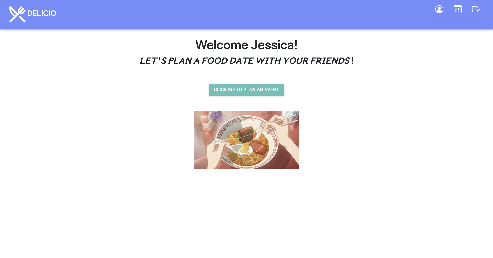

# Delicio

Live Demo: https://capstone-delicio.herokuapp.com/

## Description

Delicio is a a fun new app available on both mobile and computer web browser to help you and your friends answer the age old question: where should we go eat? As you may have experienced in the past, getting a group of people to agree upon a restaurant can be a tedious back and forth on a never ending group text. Let Delicio help you and your friends get to the point and decide where to go by letting your eyes decide! After all, a picture is worth a thousand bites! This is where Tinder meets Yelp, where you and your friends vote in a fun and unbiased way by swiping right on the dishes that make your mouth water! Once everybody has cast their votes, Delicio will deliver to you the winning restaurant!

## Features

- User signup and login
- Edit user information
- User data is secured using web tokens
- Create an food event
- Invite and all friends to an event
- Answer questions for restaurant selection
- Swipe through food pictures for restaurant selection
- View all event and await for organizer to confirm

## ScreenShots

## Technologies Used

- JavaScript
- React
- Redux
- PostgreSQL
- Sequelize
- Node
- Express
- Material-UI
- Progressive Web App
- YELP API

## Meet the Team

- Jessica Chen [Github](https://github.com/yajessicachen) | [Linkedin](https://www.linkedin.com/in/yajessicachen/)
- Rachel Or [Github](https://github.com/rachelor7) | [Linkedin](https://www.linkedin.com/in/or-rachel/)
- Vida Feng [Github](https://github.com/vidafeng) | [Linkedin](https://www.linkedin.com/in/vidafeng/)
- Renee Du [Github](https://github.com/doozyu) | [Linkedin](https://www.linkedin.com/in/renee-du-35b28a237/)
